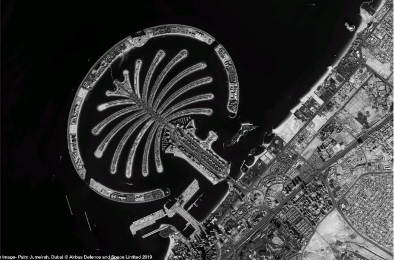
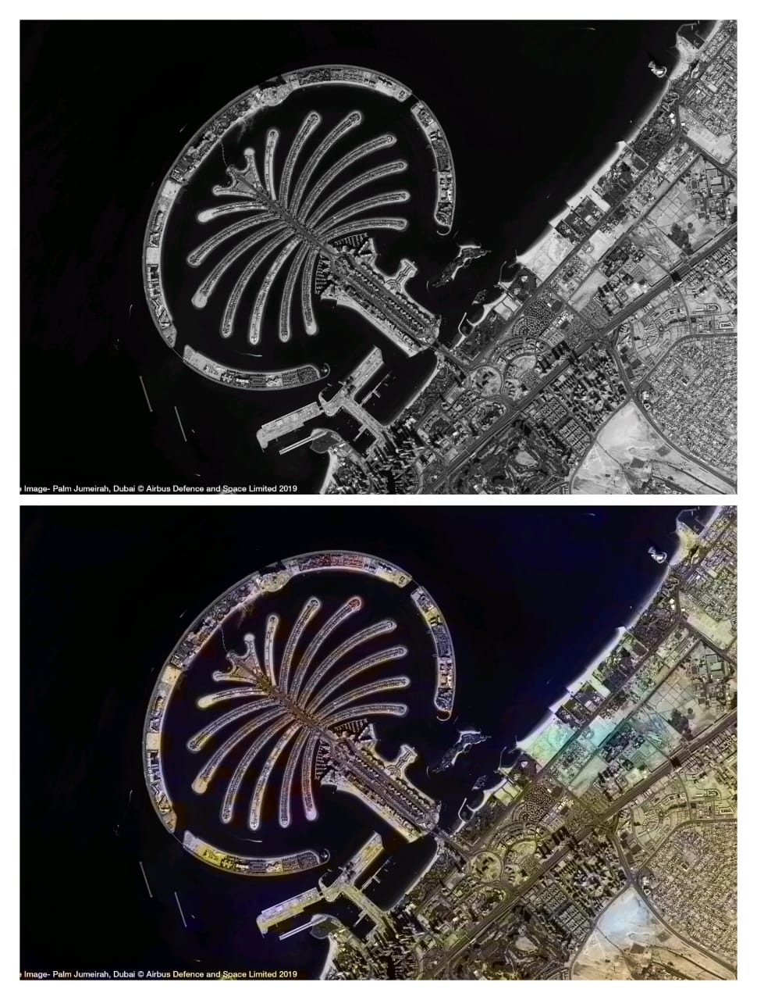

<<<<<<< HEAD
<p align="center">
  <h1 align="center">🌍 SAR Image Colorization for Comprehensive Insight</h1>
  <h3 align="center">Using Deep Learning Model</h3>
</p>

---

## 📌 Project Overview

Synthetic Aperture Radar (SAR) images are captured in grayscale format and lack visual interpretability compared to optical images.

This project presents a **Deep Learning-based SAR Image Colorization system** that enhances grayscale SAR images into realistic color representations using Convolutional Neural Networks (CNN).

The system improves visualization, interpretation, and analytical insight of satellite imagery for:

- 🌊 Water body detection  
- 🏙 Urban area mapping  
- 🌾 Agricultural monitoring  
- 🛰 Remote sensing analysis  
- 🛡 Defense & surveillance  

---

## 🎯 Problem Statement

SAR images are highly informative but difficult to interpret visually because they are grayscale and contain speckle noise.

Manual analysis requires expertise.

👉 Our solution automatically colorizes SAR images using a Deep Learning model to enhance interpretability and visual clarity.

---

# 🛠 Tech Stack

<p align="center">


</p>

---

## 🏗 System Architecture

```
Input SAR Image (Grayscale)
        ↓
Preprocessing (Resize, Normalize)
        ↓
Deep Learning Model (CNN)
        ↓
Color Prediction (a*b Channels)
        ↓
Reconstruction (LAB → RGB)
        ↓
Colorized SAR Image (Output)
```

---

## 📁 Project Structure

```
SAR-Image-Colorization/
│
├── models/
├── images/
├── output/
├── results/
│    ├── grayscale_input.png
│    ├── colorized_output.png
│    └── comparison.jpeg
│
├── app.py
├── image_colorization.py
├── GUI.py
├── requirements.txt
└── README.md
```

---

# 🖼 Results

### 🔹 Grayscale SAR Image

<p align="center">
  
</p>

---

### 🔹 Colorized Output

<p align="center">
  
</p>

---

### 🔹 Before vs After Comparison

<p align="center">
  
</p>

---

## ⚙ Installation & Setup Guide

### 1️⃣ Clone Repository

```bash
git clone https://github.com/yourusername/SAR-Image-Colorization.git
cd SAR-Image-Colorization
```

### 2️⃣ Install Dependencies

```bash
pip install -r requirements.txt
```

### 3️⃣ Run Application

```bash
python app.py
```

OR

```bash
python image_colorization.py
```

---

## 📈 Model Working

- Converts RGB → LAB color space  
- Uses L channel as model input  
- CNN predicts a*b chrominance channels  
- Reconstructs LAB → RGB image  
- Generates enhanced color output  

---

## 🔬 Applications

- Remote sensing  
- Environmental monitoring  
- Smart agriculture  
- Urban planning  
- Defense surveillance  
- Disaster assessment  

---

## 📚 Research Contribution

This project is developed as a **research-oriented group project** focusing on Deep Learning-based SAR image enhancement.

---

# 👨‍💻 Project Team

### 🎓 Under the Guidance of

**Prof. P. D. Lanjewar**  
Assistant Professor, Department of AIML  
R C Patel Institute of Technology  
Shirpur, Maharashtra  

---

### 👩‍💻 Student Contributors

- Dipali Mali  
- Neha Gayakawad  
- Bhavesh Patil  
- Gaurang Mali  
- Kalpesh Mahajan  

---

## 🚀 Future Enhancements

- U-Net architecture implementation  
- GAN-based colorization  
- Attention mechanism integration  
- Real-time web deployment  
- Performance benchmarking using PSNR & SSIM  

---

## 📄 License

Developed for academic and research purposes.

---

<p align="center">
⭐ If you found this project helpful, please consider giving it a star!
</p>
=======
# SAR-Image-Colorization
>>>>>>> 6eda4258c6ac952bf766032e73660d9286b00413
